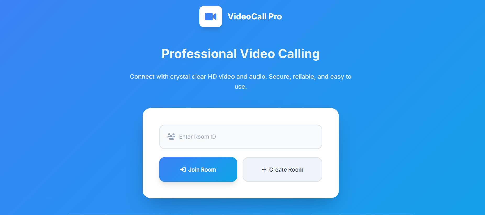
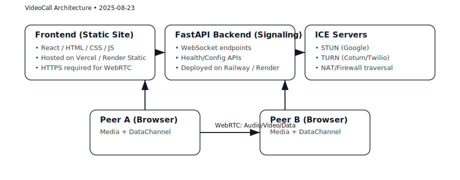
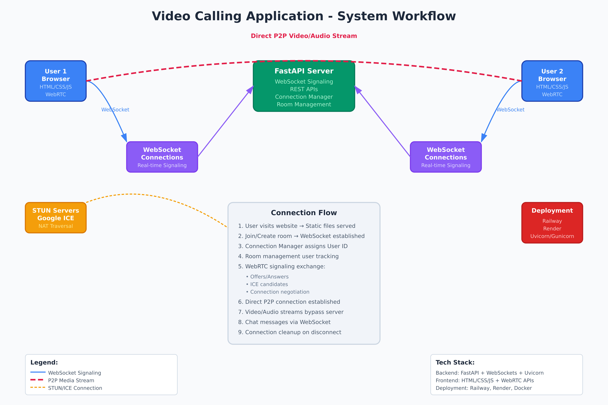
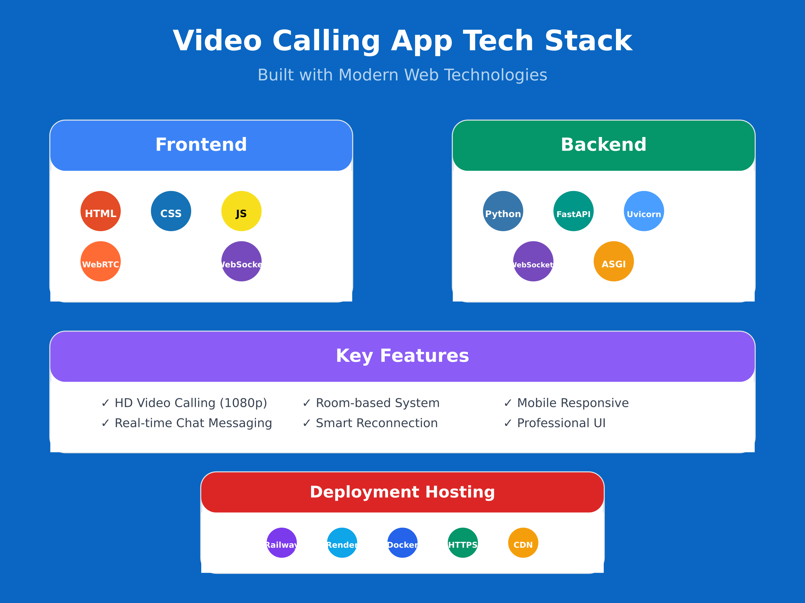

# Professional Video Calling Application

A modern, professional-grade video calling application built with **FastAPI** and **WebRTC**.

## 🌐 Live Demo
- Railway: https://veecall-production.up.railway.app/
- Render: https://veecall.onrender.com/
  
## 📸 Screenshots / Demo

- Landing page (Join/Create Room):  
  


---


## 🚀 Features

### Core Features
- **HD Video Calling**: Crystal clear video up to 1080p resolution
- **High-Quality Audio**: Echo cancellation, noise suppression, and auto gain control
- **Real-time Chat**: In-call messaging system
- **Room-based System**: Join existing rooms or create new ones
- **Responsive Design**: Works on desktop and mobile devices
- **Professional UI**: Modern, clean interface with smooth animations

### Advanced Features
- **Automatic Reconnection**: Smart reconnection with exponential backoff
- **Enhanced Error Handling**: Comprehensive error management and user feedback
- **WebRTC Optimization**: Multiple STUN servers for better connectivity
- **Real-time Status**: Connection status indicators
- **Media Controls**: Mute/unmute audio and video controls
- **Room Management**: Copy room IDs, user tracking system

## ⚖️ Deployment Platforms (Comparison)

| Platform | Pros | Cons | Best For |
|---|---|---|---|
| **Railway** | Very fast setup, Git auto-deploys, good DX | Free tier may sleep; limited scaling | Prototyping & demos |
| **Render** | Stable uptime on free tier, free SSL, custom domains | Cold starts on free tier | Small production / student projects |
| **Vercel (Frontend Only)** | Global CDN, instant rollbacks | No WebSockets for FastAPI backend | Hosting React/HTML frontend |
| **Fly.io** | Low-latency global regions, good for realtime | Slightly higher setup complexity | Realtime apps at scale |
| **AWS/DO (Droplet/EC2)** | Full control, can host TURN | More DevOps work; paid | Production at larger scale |

> 📝 **Note:** For the FastAPI backend with WebSockets, prefer **Railway/Render/Fly.io**. You can still host the **frontend** on **Vercel** and point it to your backend.

## 🏗 Architecture

High-level architecture of the app:

- **Frontend** (React/HTML/CSS/JS) serves UI and calls backend APIs
- **FastAPI Backend** provides signaling over WebSockets + REST (health/config/room APIs)
- **ICE (STUN/TURN) Servers** enable NAT traversal
- **Peers (Browsers)** exchange audio/video/data directly via WebRTC






## 🛠 Technical Optimizations

### Backend Improvements
1. **Enhanced Connection Management**
   - User ID tracking system
   - Room management with automatic cleanup
   - Better error handling and logging
   - Connection state monitoring

2. **WebRTC Configuration**
   - Multiple STUN servers for reliability
   - ICE candidate pool optimization
   - Connection timeout handling

3. **API Enhancements**
   - Health check endpoint
   - Room information API
   - WebRTC configuration endpoint
   - CORS support for development

4. **Modern FastAPI Patterns**
   - Lifespan event handlers (replacing deprecated `on_event`)
   - Proper exception handling
   - Type hints and validation

### Frontend Improvements
1. **Enhanced WebRTC Implementation**
   - Better offer/answer handling
   - ICE candidate management
   - Connection state monitoring
   - Automatic peer connection restart

2. **User Experience**
   - Smart reconnection logic
   - Input validation
   - Loading states and feedback
   - Toast notifications
   - Error recovery

3. **Media Handling**
   - Higher quality video constraints
   - Audio processing options
   - Better device access error handling
   - Stream cleanup

4. **Code Quality**
   - Better error handling
   - Resource cleanup
   - Event management
   - State management
  


## 📋 Requirements

### System Requirements
- Python 3.8+
- Modern web browser with WebRTC support
- Camera and microphone access

### Dependencies
- FastAPI 0.115.13
- Uvicorn 0.34.3 (with standard extras)
- WebSockets 12.0
- Python Multipart 0.0.18

## 🚀 Quick Start

### 1) Install Dependencies
```bash
python -m pip install -r requirements.txt
```

### 2) Run the Server (Dev)
```bash
python videocalling.py
```

### 3) Open the Application
Visit: `http://localhost:8001`

### 4) Start a Video Call
1. Click **Create Room** to generate a new room
2. Share the room ID with another participant
3. The other participant can join using **Join Room**
4. Grant camera and microphone permissions when prompted

## 🎮 Usage

### Creating a Room
1. Click the **Create Room** button on the landing page
2. A unique room ID will be generated automatically
3. Share this room ID with participants you want to invite

### Joining a Room
1. Enter the room ID in the input field
2. Click **Join Room**
3. Wait for the connection to establish

### During a Call
- **Mute/Unmute**: Microphone button
- **Camera On/Off**: Video button
- **End Call**: Red phone button
- **Chat**: Chat icon
- **Copy Room ID**: Copy button

## 🔧 Configuration

### Server Configuration
Default config in `videocalling.py`:
```python
config = {
    "host": "0.0.0.0",
    "port": 8001,
    "log_level": "info",
    "access_log": True,
    "reload": False
}
```

### WebRTC Configuration
```python
WEBRTC_CONFIG = {
    "iceServers": [
        {"urls": "stun:stun.l.google.com:19302"},
        {"urls": "stun:stun1.l.google.com:19302"},
        {"urls": "stun:stun2.l.google.com:19302"},
        {"urls": "stun:stun3.l.google.com:19302"},
        {"urls": "stun:stun4.l.google.com:19302"}
    ],
    "iceCandidatePoolSize": 10
}
```

## 🐛 Troubleshooting

**Common Issues**
1. Camera/Microphone Access Denied → allow browser permissions; ensure no other app is using the camera
2. Connection Failed → check internet and firewall; try a different browser
3. A/V Quality Issues → close heavy apps; adjust video constraints
4. Room Connection Issues → verify room ID; create a new room

**Dev Issues**
- Server Won't Start → verify port 8001 free; dependencies installed
- WebSocket Failure → server running? firewall/AV? browser support?

## 🔒 Security Considerations

1. **Peer-to-peer Media**: All A/V is P2P via WebRTC
2. **No Recording by Default**: No media stored on server
3. **Signaling Only**: Server handles signaling (offers/answers/candidates)
4. **HTTPS Required**: Use HTTPS in production for getUserMedia and WebRTC

## 📈 Performance Tips

- **Server**: Use production ASGI (e.g., `uvicorn` with multiple workers), tune logging
- **Client**: Prefer wired/wifi-5+, good lighting, close unused tabs

## 🚀 Deployment

### Development
```bash
python videocalling.py
```

### Production
```bash
uvicorn videocalling:app --host 0.0.0.0 --port 8001 --workers 4
```

### Docker (Optional)
```dockerfile
FROM python:3.11-slim
WORKDIR /app
COPY requirements.txt .
RUN python -m pip install --no-cache-dir -r requirements.txt
COPY . .
EXPOSE 8001
CMD ["python", "videocalling.py"]
```

### Important Deployment Notes
- ✅ Use **HTTPS** for WebRTC to work in browsers
- ✅ Configure **CORS** if frontend and backend are on different domains
- ✅ Add **TURN server** (e.g., Coturn or a managed service) for production reliability behind strict NATs
- ✅ If hosting frontend on **Vercel**, host backend on **Railway/Render/Fly.io** and set env vars for API/WS URLs

## 📝 Changelog

### v2.0.0
- Complete rewrite with enhanced architecture
- Improved WebRTC implementation
- Better error handling and reconnection
- Modern FastAPI patterns
- Enhanced UI/UX
- Real-time chat system
- Professional styling

### v1.0.0
- Basic video calling functionality
- Simple room system
- Basic WebRTC implementation

## 🤝 Contributing

1. Fork the repository
2. Create a feature branch
3. Make your changes
4. Test thoroughly
5. Submit a pull request

## 📄 License

MIT License

## 💡 Future Enhancements

- [ ] Screen sharing
- [ ] Recording
- [ ] User authentication
- [ ] Room passwords
- [ ] File sharing
- [ ] Multiple participants
- [ ] Mobile app
- [ ] TURN server integration

---

Built with ❤️ using **FastAPI** and **WebRTC**.
